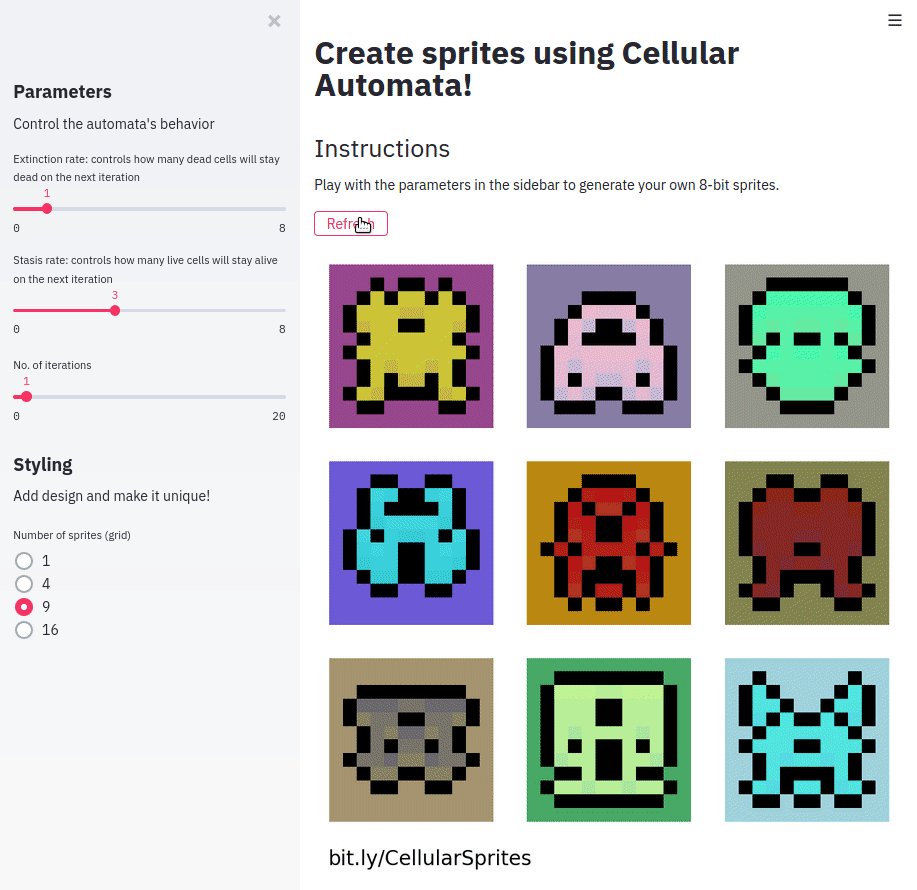

# Cellular Sprites

Generate 8-bit sprites using Cellular Automata and Seagull!
You can find the web application [here](https://cellular-sprites.herokuapp.com/)!



## Running locally

Ensure that you have Python 3.6+ above and pip. First, install
all dependencies:

```sh
pip install -r requirements.txt
```

Then, run [streamlit](https://streamlit.io):

```sh
streamlit run CellularSprites.py
```

